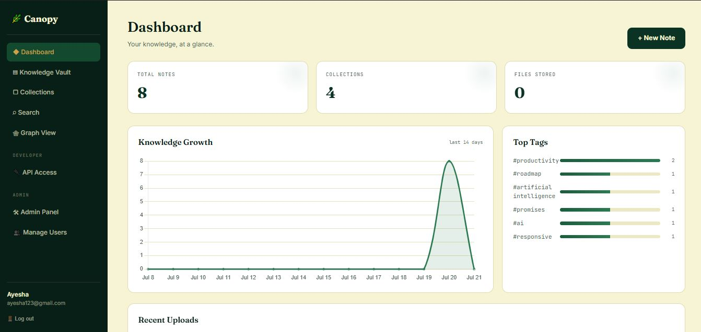
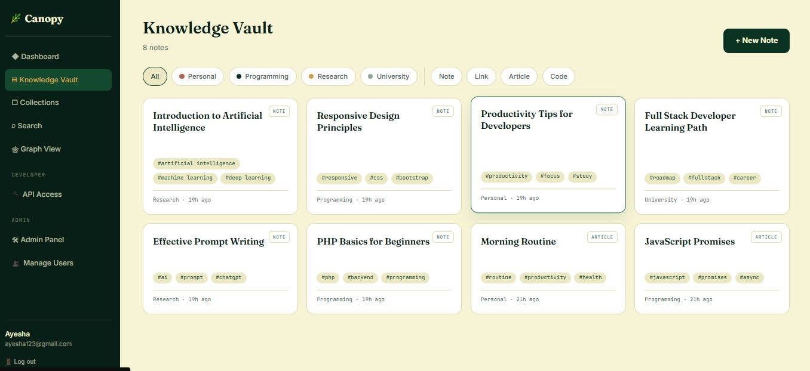
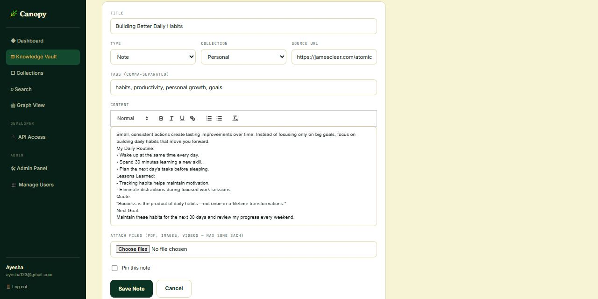
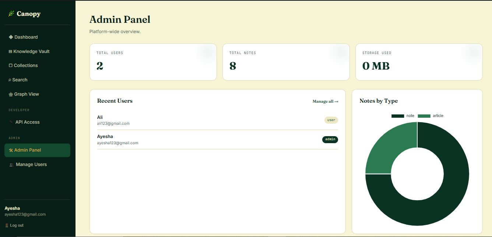

<div>

# 🌿 Canopy

### Where your ideas take root and branch.

A full-stack knowledge management platform — Notion + Obsidian + Evernote,
unified into one dashboard, with notes that automatically link themselves
to related notes. Built from scratch in PHP + MySQLi, with no framework
hiding the fundamentals.


**🔗 Live Demo https://canopy.infinityfree.me/**

[Features](#-key-features) • [Screenshots](#-screenshots) • [Tech Stack](#️-technologies-used) • [Getting Started](#-getting-started) 
• [Roadmap](#️-roadmap)

</div>

---

## 🌟 About the Project

Knowledge management usually means juggling a Notion doc for notes, a
separate app for file storage, a spreadsheet for tracking what you've
learned, and no real way to see how any of it connects. **Canopy**
replaces all of it with one dashboard.

Add a note — a link, an article, a code snippet, whatever — and it's
instantly searchable, taggable, and filed into a color-coded collection.
The part that makes it more than a notes app: every time you save a note,
Canopy automatically finds other notes you own that share a tag or a
topic, and links them together on the spot. No manual linking, no graph
database, no external API — just SQL, computing the same "connected ideas"
feeling Obsidian is known for.

Everything runs on a real backend: PHP sessions for auth, MySQLi prepared
statements for every query, and a relationship engine you can read start
to finish in one file.

---

## 📸 Screenshots

<div align="center">

| Dashboard | Knowledge Vault |
|:---:|:---:|
|  |  |

| Note Detail | Admin Panel |
|:---:|:---:|
|  |  |

| Graph View | API Access |
|:---:|:---:|
|  |  |

</div>

---

## ✨ Key Features

### 🔐 Authentication
- Registration with server-side validation
- Secure login (`password_hash()` / `password_verify()`)
- Forgot / reset password flow with expiring tokens
- First registered user is automatically promoted to admin

### 🧠 Knowledge Vault
- Notes, links, articles, and code snippets in one unified model
- Rich text editing via Quill.js — headings, lists, code blocks, quotes
- File attachments — PDFs, images, videos (20MB cap, validated server-side)
- Tagging with autocreate-on-write
- Collections — color-coded folders for high-level organization
- Pin important notes to the top

### 🕸️ Smart Relationships
- Notes are automatically linked based on shared tags and overlapping
  title keywords — no manual linking required
- Computed entirely in SQL, recalculated on every create/update
- Surfaced on every note page as a "Related Notes" panel, with the reason
  for the connection shown alongside it

### 🕸️ Graph View
- Every note and its connections, rendered as an interactive
  force-directed graph with D3.js
- Drag nodes to rearrange, scroll to zoom, click a node to open that note
- Node size scales with how connected that note is; hovering a node
  highlights the reason for each connection

### 🔌 REST API
- Token-based authentication — generate and revoke Bearer tokens from
  API Access in the app, no shared passwords needed
- Full CRUD on notes (`GET`/`POST`/`PUT`/`DELETE /api/notes.php`) plus a
  read-only collections endpoint, all returning JSON
- CORS-enabled, so it's callable from your own scripts, a CLI tool, or a
  separate frontend entirely

### 📧 Real Password Reset Email
- Password resets are sent via SMTP through PHPMailer (vendored, no
  Composer required) when configured in `config.php`
- Falls back to showing the reset link on-screen when SMTP isn't
  configured, so local development never gets blocked

### 🔍 Search
- Full-text search across titles, content, and tags
- Instant filtering by collection and content type

### 📊 Dashboard
- Live stats — total notes, collections, files stored
- 14-day knowledge growth chart (Chart.js)
- Top tags ranked by usage
- Recent uploads feed

### 🛠 Admin Panel
- Platform-wide stats — users, notes, storage consumed
- User management — promote, demote, or delete accounts
- Notes-by-type breakdown chart

---

## 🛠️ Technologies Used

### Backend & Database


### Frontend


| Purpose | Tool | Why |
|---|---|---|
| Backend logic | PHP 8.x, procedural | Auth, sessions, and queries written by hand — no framework doing it for you |
| Database | MySQL / MySQLi | Prepared statements throughout; relational modeling for notes, tags, files, and the relationship graph |
| Rich text editing | Quill.js | Lightweight WYSIWYG editor, loaded via CDN |
| Dashboard charts | Chart.js | Growth chart, top tags, notes-by-type breakdown |
| Graph visualization | D3.js | Force-directed graph of note relationships |
| Transactional email | PHPMailer (vendored, no Composer) | SMTP-based password reset emails |
| Styling | Custom CSS — Fraunces, Inter, JetBrains Mono | A "knowledge garden" identity in deep botanical green and parchment cream |

No Composer, no npm, no build pipeline. Clone it, point Apache at it, done.

---

## 🕸️ How the Smart Relationships Engine Works

This is the feature worth walking an interviewer through.
`sync_smart_relationships()` in `includes/functions.php` runs after every
note create/update and links the note to others owned by the same user
using two signals:

1. **Shared tags** — a `JOIN` across `note_tag` finds every other note
   that shares at least one tag, and records *which* tags were shared as
   the human-readable reason.
2. **Title keyword overlap** — significant words (4+ letters) are
   extracted from the note's title and matched against other titles with
   `LIKE`.

```sql
-- simplified shape of the shared-tag query
SELECT DISTINCT n2.id, GROUP_CONCAT(DISTINCT t.name) AS shared
FROM note_tag nt1
JOIN note_tag nt2 ON nt1.tag_id = nt2.tag_id AND nt2.note_id != nt1.note_id
JOIN notes n2 ON n2.id = nt2.note_id
JOIN tags t  ON t.id = nt1.tag_id
WHERE nt1.note_id = ? AND n2.user_id = ?
GROUP BY n2.id;
```

Results are stored in a dedicated `note_relationships` table and rendered
as a "Related Notes" panel, and as a full interactive graph on the
Graph View page — giving the Notion/Obsidian-style graph-linking
experience without an external embeddings API.

---

## 🔒 Security

- **Prepared statements everywhere** — zero raw string concatenation of
  user input into SQL
- **Password hashing** via `password_hash()` / `password_verify()`
- **CSRF tokens** validated on every state-changing POST request
- **Per-user data scoping** — every query filters by `user_id`, enforced
  server-side, not just hidden in the UI
- **Upload hardening** — `uploads/.htaccess` disables PHP execution inside
  the uploads directory, so a disguised `.php` upload can't run
- **API tokens** — REST API access is scoped to bearer tokens that can be
  generated and revoked independently of the account password

---

## 🗺️ Roadmap

- [x] Auth — register, login, forgot/reset password
- [x] Knowledge Vault — notes, links, articles, code snippets
- [x] File uploads with type/size validation
- [x] Smart Relationships engine
- [x] Collections, tags, full-text search
- [x] Dashboard with live analytics
- [x] Admin panel with user management
- [x] Force-directed graph visualization of note relationships (D3.js)
- [x] Real transactional email for password resets (PHPMailer + SMTP)
- [x] REST API layer with token-based auth, for third-party integrations
- [ ] Drag-and-drop uploads with progress bars
- [ ] Admin audit log (create/edit/delete history)
- [ ] Public share links for individual notes

Contributions and forks are welcome — open an issue if you'd like to pick
one of these up.

---

## 🧪 Testing

Every flow in this repo — registration, login, note CRUD, tag-based smart
relationships, graph view, file upload/download, cascading delete, search,
collections, REST API endpoints, and the admin panel — has been manually
exercised end-to-end against a real MySQL instance to confirm there are no
runtime errors.

---

## 👩‍💻 Developer

**Ayesha Amjad** — Full-Stack Developer (Front-End Focused) & Digital Marketing Specialist

📧 [ayeshaamjad819@gmail.com](mailto:ayeshaamjad819@gmail.com)
🔗 [github.com/AyeshaCodes25](https://github.com/AyeshaCodes25)

If Canopy was useful or interesting to you, consider giving the repo a ⭐ — it helps other people find it too.

</div>
